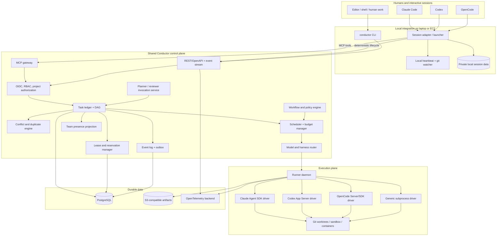
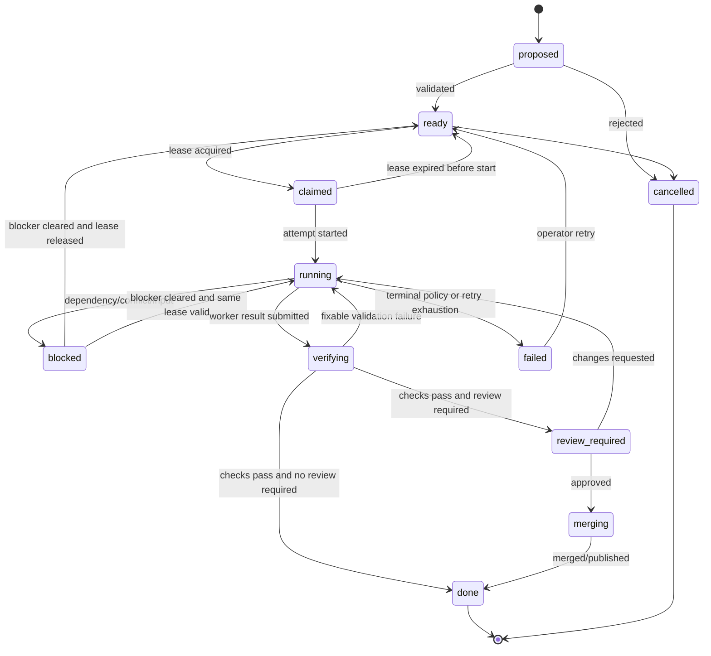
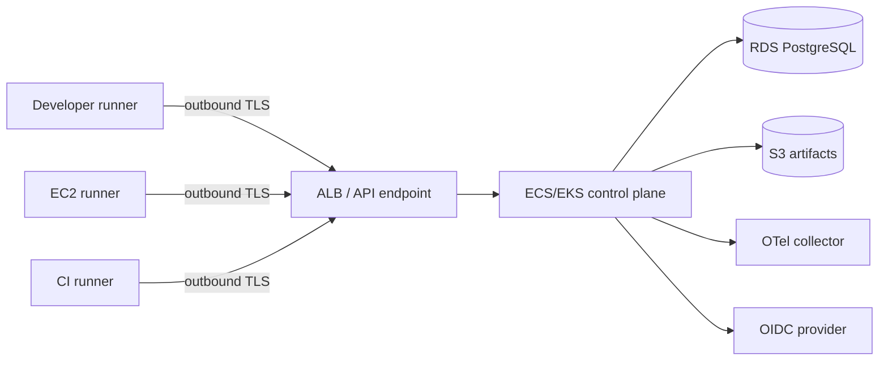

# Conductor: Cross-Harness Agent Orchestration and Collaboration Platform

**Status:** Proposed architecture, v0.1  
**Date:** 2026-08-16  
**Working name:** Conductor; rename before a public launch if necessary.  
**Audience:** Platform engineers building a shared control plane for Claude Code, Codex, OpenCode, local models, and future coding-agent harnesses.

---

## 1. Executive decision

Build **a standalone, long-running coordination control plane** with three integration layers:

1. **MCP server:** gives every supported coding agent a common set of coordination tools such as `start_work`, `expand_scope`, `report_progress`, `handoff`, and `finish_work`.
2. **Thin native integrations:** Claude Code hooks/plugin, an OpenCode plugin, and a Codex skill/configuration plus launcher wrapper. These integrations register sessions and enforce coordination without depending on the model to remember to call an MCP tool.
3. **Programmatic harness drivers:** Claude Agent SDK, Codex App Server, and OpenCode Server/SDK launch and supervise autonomous worker runs.

The control plane—not an LLM—owns tasks, leases, conflict detection, privacy, retries, budgets, and state transitions. A frontier model is invoked as a **logical coordinator role** only when planning, replanning, resolving ambiguity, or reviewing high-risk changes. Cheaper workers perform normal implementation.

### Direct answer: plugin, MCP, or orchestrator?

| Mechanism | Use it for | Do not use it as |
|---|---|---|
| Standalone service | Shared task ledger, leases, team presence, scheduling, routing, authorization, conflict detection, audit, retries | A chat client or model-specific extension |
| MCP | A vendor-neutral tool surface exposed to agents | The scheduler, high-frequency heartbeat channel, process supervisor, or database |
| Native plugin/hook/skill | Automatic session registration, pre-edit checks, status display, lifecycle events, packaging and installation | The cross-team source of truth |
| Harness SDK/API | Launching, streaming, pausing, resuming, and cancelling autonomous Claude/Codex/OpenCode runs | Shared coordination between vendors |

The most important architectural distinction is:

- **Northbound agent interface:** MCP and small CLI commands.
- **Southbound execution interface:** each harness's native SDK/server/CLI.
- **Shared source of truth:** Conductor's API and PostgreSQL ledger.

---

## 2. Problem statement

A developer may have several concurrent sessions on one EC2 machine, for example:

- a frontier Claude session analyzing the repository and planning;
- one or more Codex sessions implementing changes;
- OpenCode workers using GLM, Kimi, local models, or other providers;
- manual human edits in another worktree;
- coworkers running their own sessions against the same repository.

Without a shared control plane, these sessions can:

- duplicate the same task;
- make logically conflicting changes in isolated worktrees;
- waste frontier-model tokens on mechanical work;
- lose decisions when a task moves between tools;
- silently diverge from repository rules;
- overwrite or invalidate another worker's work;
- expose private chat transcripts merely to obtain coordination.

Conductor treats humans and agents as participants in one project-level work graph while keeping each chat private.

---

## 3. Requirements

### 3.1 Functional requirements

1. Run a frontier planner/reviewer while dispatching cheaper implementation workers.
2. Route both the **model** and the **harness** independently.
3. Choose reasoning effort adaptively for each task and each retry.
4. Coordinate Claude Code, Codex, OpenCode, scripted agents, and human sessions.
5. Detect duplicate work before implementation begins.
6. Detect likely merge or semantic conflicts before branches collide.
7. Support multiple humans working on the same project.
8. Keep raw chats, prompts, hidden reasoning, and private notes out of team-visible state.
9. Preserve a task across tool or model handoffs.
10. Enforce repository-owned workflow and validation rules.
11. Isolate autonomous workers in worktrees and, where practical, OS sandboxes or containers.
12. Recover from crashes, stale sessions, expired leases, rate limits, and partial execution.
13. Expose a dashboard showing work, ownership, scope, dependencies, checks, branches, and blockers.
14. Produce portable Markdown task cards for code builders and manual handoffs.

### 3.2 Non-goals for the first release

- A centralized viewer for everyone’s chat history.
- Storage or redistribution of model chain-of-thought.
- Real-time collaborative editing of the same file.
- Replacing GitHub, Linear, Jira, or another issue tracker.
- Automatically merging every agent change without project policy.
- A universal agent conversation protocol.
- Perfect semantic conflict prediction in the MVP.
- Supporting arbitrary nested agent swarms with no limits.

---

## 4. Design principles

1. **Deterministic state before probabilistic judgment.** LLMs may propose plans and classifications; they never own a lock, lease, state transition, or authorization decision.
2. **Privacy by default.** Publish a structured work declaration, not a transcript.
3. **One task, many attempts.** Models and harnesses may change without changing task identity.
4. **Leases, not permanent locks.** Every active claim expires unless heartbeats renew it.
5. **Fencing tokens prevent stale workers.** A worker whose lease expired cannot report completion or mutate canonical state.
6. **Isolation plus coordination.** Worktrees prevent local file corruption; reservations and a merge-risk graph prevent logical duplication.
7. **Repository-owned policy.** Workflow rules are versioned with the code and identified by a content hash on every run.
8. **Model aliases, not hardcoded model names.** Policies use roles such as `planner.frontier`, `worker.fast`, and `reviewer.strong`.
9. **Minimal MCP surface.** Too many tools waste context and make tool selection less reliable.
10. **No expensive model in the hot path.** Heartbeats, conflict checks, scheduling, and retries are deterministic.
11. **Evidence over claims.** Completion means a commit/diff plus test and validation evidence, not merely an agent saying it finished.
12. **Humans and agents use the same task model.** Human sessions can claim, reserve, hand off, block, review, and finish work just like autonomous runs.

---

## 5. Terminology

| Term | Meaning |
|---|---|
| Project | A registered repository and its coordination policy |
| Principal | A human, service account, or agent identity |
| Session | One interactive or autonomous harness session |
| Task | A durable unit of intended work |
| Attempt | One execution of a task by a particular harness/model |
| Claim | Exclusive right to actively execute a task during a lease |
| Lease | Time-bounded ownership renewed by heartbeat |
| Fencing token | Monotonically increasing lease epoch included in every mutation |
| Scope reservation | Declared read/write/review interest in files, symbols, APIs, schemas, or migrations |
| Intent envelope | Sanitized coordination metadata derived from a private request |
| Task card | Portable Markdown representation of a task |
| Harness | Claude Code, Codex, OpenCode, or another agent runtime |
| Model profile | Provider/model capabilities, cost, latency, context, reasoning controls, and policy eligibility |
| Workflow | Versioned repository policy and agent instructions |
| Artifact | Commit, patch, diff, test result, PR, report, or other output |
| Handoff bundle | Minimal state needed to continue a task in another session without sharing chat |

---

## 6. High-level architecture



### Privacy boundary

`Private local session data` contains raw chats and tool-specific history. It does not flow into the shared control plane. The shared service receives only explicitly allowed fields such as:

- task identifier and optional sanitized summary;
- claimed files/directories/symbols;
- branch, worktree, commit, and PR references;
- state, blocker, test status, and timestamps;
- model/harness metadata if project policy allows it;
- explicit decisions and handoff notes;
- hashes used for duplicate detection.

---

## 7. Core components

### 7.1 Control-plane API

Responsibilities:

- authenticate humans, sessions, and runners;
- enforce organization/project boundaries;
- provide idempotent task, claim, reservation, artifact, and handoff operations;
- stream project events over Server-Sent Events or WebSocket;
- expose an OpenAPI contract for clients and generated SDKs;
- reject mutations from stale fencing tokens.

Use REST for the public machine API. Use SSE first for event subscriptions because it is simple through load balancers. Add WebSocket only when bidirectional interactive approvals require it.

### 7.2 MCP gateway

The MCP gateway is a thin translation layer over the control-plane API. It should not contain scheduling logic or independent state.

Keep the initial tool set small:

1. `coord_start_work`
2. `coord_get_work`
3. `coord_expand_scope`
4. `coord_report_progress`
5. `coord_publish_result`
6. `coord_finish_work`
7. `coord_handoff`
8. `coord_project_status`

High-frequency heartbeat is deliberately not an MCP call. A local adapter sends it directly so no model tokens are consumed.

### 7.3 Session registry and presence

Each session registers:

- project ID;
- user/sponsor identity;
- harness and version;
- machine/runner ID;
- repository base commit;
- current branch/worktree;
- visibility policy;
- optional active task;
- last heartbeat and state.

Presence states:

- `online_idle`
- `planning`
- `working`
- `waiting_for_input`
- `blocked`
- `reviewing`
- `offline_grace`
- `stale`
- `closed`

The team view shows session metadata and work state, never raw conversation content.

### 7.4 Task ledger and dependency graph

The task ledger is the canonical representation of work. It stores:

- task identity and optional external issue key;
- sanitized objective and private encrypted details;
- acceptance criteria;
- task status and risk;
- dependency edges;
- predicted and actual scopes;
- current claim and attempt;
- artifacts and verification evidence;
- workflow/config hashes;
- visibility and authorization policy.

Tasks may be created manually, imported from an issue tracker, or proposed by a planner. Planner-proposed tasks remain `proposed` until deterministic validation succeeds.

### 7.5 Lease manager

The lease manager provides:

- atomic task acquisition;
- heartbeat renewal;
- expiration and recovery;
- monotonic fencing epochs;
- claim release;
- per-user, per-runner, per-model, and per-project concurrency limits.

Every mutation associated with active execution includes:

```text
task_id + attempt_id + lease_id + fencing_epoch
```

A stale worker can continue writing in its isolated worktree, but the control plane rejects its progress, completion, and merge requests until an operator explicitly reconciles it.

### 7.6 Conflict and duplicate engine

The engine combines deterministic and advisory checks:

1. exact task or issue identity;
2. privacy-preserving intent fingerprint;
3. overlapping write reservations;
4. overlapping protected resources;
5. branch/diff overlap;
6. optional semantic similarity of sanitized summaries;
7. optional symbol/API/schema dependency analysis.

The engine produces an action, not merely a score:

- `allow`
- `allow_with_warning`
- `block_duplicate`
- `block_conflict`
- `suggest_join`
- `suggest_split`
- `suggest_wait`
- `suggest_supersede`

### 7.7 Scheduler

The scheduler chooses a ready task based on:

- dependency satisfaction;
- priority and age;
- active claims and conflicts;
- runner and provider capacity;
- project concurrency;
- budget availability;
- required capabilities and data-residency policy;
- retry/backoff state.

Use PostgreSQL row locking with `FOR UPDATE SKIP LOCKED` for the first implementation. Do not introduce Redis solely for a queue.

### 7.8 Model and harness router

Routing is two-dimensional:

- **Harness selection:** Claude Agent SDK, Codex App Server, OpenCode Server/SDK, or generic subprocess.
- **Model selection:** provider/model plus reasoning effort and budget.

The router uses deterministic policy first, then an optional cheap classifier. A model may never route around a hard policy.

### 7.9 Planner and reviewer service

The planner is an invocation service, not a permanent chat session. It runs when:

- a large objective needs decomposition;
- repository changes invalidate an existing plan;
- a worker exceeds predicted scope;
- repeated failures require a new approach;
- dependencies or conflicts change materially.

The reviewer runs when risk policy requires it or a worker is escalated. It receives:

- workflow rules;
- task card;
- diff/commit;
- relevant code context;
- verification evidence;
- prior review findings;

It does not receive the worker's private chat or hidden reasoning.

### 7.10 Runner daemon

A runner is installed on each machine allowed to execute tasks. It:

- advertises harnesses, models, tools, capacity, and sandbox capabilities;
- receives signed attempt specifications;
- creates or reuses isolated worktrees;
- launches the selected harness driver;
- captures structured lifecycle events;
- renews the lease;
- tracks actual changed paths;
- uploads approved artifacts;
- terminates on cancellation, lease loss, budget exhaustion, or policy violation.

Runners connect outbound to the control plane so a developer laptop or EC2 host does not need an inbound public port.

### 7.10a Session capability advertisement and assignment

A runner advertises what a *machine* could run. A session advertises what one *running* agent
is, right now: the model it is driving, the reasoning effort it is running at, and the ceiling
it can be raised to. Without that, presence can say who is here but not who can do a given
piece of work, and a task that needs a frontier model at high effort gets started by whoever
asked first.

**Declared, then resolved.** A session declares harness, model, effort, an optional effort
ceiling, and optionally the roles it will accept. The control plane resolves the declared model
against the organization's model catalog and fills in tier, capability tags, and context window
from the matching profile. A session cannot assert its own tier: if it could, a capability
floor would be a suggestion. A model that matches no profile stays *unresolved* — usable for
work that names no tier or capability floor, ineligible for anything that does.

**Requirement.** A capability requirement is a set of floors: tier, reasoning effort,
capability tags, harness, model, role, context window. Every populated field is a floor, never
a preference. Preferences that may be traded away belong in the ranking.

**Selection.** Candidates are filtered by the floors, then ranked: least loaded first, then the
*cheapest* session that still clears every floor. Preferring the cheapest qualifying session is
deliberate — the floor already guarantees capability, and spending a frontier session on work a
mid-tier one can do makes it unavailable when something needs it. Selection is deterministic and
returns a rationale plus a reason for every rejected session, because "no capacity" alone is not
actionable and "three sessions are up, none can think that hard" is.

**Assignment is an offer, not a command.** Conductor cannot make a session do anything; it puts
work where a capable session will find it and records what happened next. An offer:

- is unique per task while open, so two coordinators racing to place the same work produce one
  offer and one conflict rather than two sessions both told the work is theirs;
- expires on its own deadline, and is released when the holding session goes stale, so a closed
  laptop cannot hold a task hostage;
- is settled by the claim: the session that takes the work fulfils its own offer, and anyone
  else claiming first cancels it.

**Escalation.** `coord_delegate` is the agent-facing form: package the continuation bundle
exactly as a handoff does, release the lease, and offer the task to a session meeting the
floor. Failure to place is not an error — the bundle is still written and the task is still
released, because losing a completed handoff because no capable session happened to be online
is strictly worse than a ready task with an explanation attached.

**Privacy.** Tier, effort, and capability tags are always published: they are what makes
capability routing possible and say nothing about what anyone is working on. The concrete model
name is execution identity and follows the same `publishModelIdentity` switch as an attempt's
(§20.2), so a team that does not broadcast which vendor each person pays for still gets working
capability routing.

### 7.11 Repository indexer

The MVP only needs Git metadata and path-level indexing. Later versions can add:

- language detection;
- tree-sitter symbol indexes;
- import/dependency graphs;
- test ownership;
- CODEOWNERS integration;
- database schema and migration awareness;
- public API and protocol definition indexes.

The index is versioned by commit SHA. Planner and conflict results must state which index version they used.

---

## 8. End-to-end workflows

### 8.1 Interactive work started in any tool

```mermaid
sequenceDiagram
    participant U as User
    participant H as Claude/Codex/OpenCode
    participant A as Local adapter
    participant C as Control plane
    participant G as Git worktree

    U->>H: Ask to implement a change
    H->>A: Lifecycle event or explicit coordination command
    A->>A: Derive sanitized intent locally
    A->>C: Check intent + requested scope
    C->>C: Duplicate/conflict evaluation
    alt Duplicate or hard conflict
        C-->>A: Block with owner/task/status
        A-->>H: Explain conflict; offer join/wait/split
    else Allowed
        C-->>A: Task + lease + fencing epoch
        A->>G: Create/select isolated worktree
        A-->>H: Inject task card and workflow context
        H->>G: Work
        A->>C: Direct heartbeat and scope updates
        H->>A: Progress/result via MCP or lifecycle event
        A->>C: Evidence + artifact metadata
        C-->>A: Verify/review/complete decision
    end
```

Modes:

- **Manual mode:** the user runs `conductor start` or invokes a coordination skill.
- **Assisted mode:** a hook/plugin locally derives an intent envelope and asks for confirmation only when the scope is ambiguous or a conflict exists.
- **Enforced mode:** an edit-capable session cannot start file writes until it has a valid claim.

The MVP should support manual and assisted modes. Enforced mode can be added per harness as integrations mature.

### 8.2 Frontier coordinator decomposes an objective

1. User or issue tracker creates a parent objective.
2. Control plane builds a repository context bundle:
   - repository map;
   - workflow policy;
   - relevant issues/tasks;
   - active reservations;
   - likely ownership and tests.
3. `planner.frontier` emits a typed `PlanSpec`.
4. The deterministic validator checks:
   - schema validity;
   - acyclic dependencies;
   - acceptance criteria presence;
   - legal scopes;
   - protected-resource policy;
   - concurrency safety;
   - budget.
5. Valid child tasks become `ready` when dependencies allow.
6. Scheduler dispatches each child to the cheapest eligible worker tier.
7. Each task is independently verified.
8. A stronger reviewer looks at integration boundaries or the aggregate diff when policy requires it.
9. Merge queue lands changes in dependency order.

### 8.3 Duplicate task launched from another session

1. A second session declares an external issue key, exact intent fingerprint, or overlapping scope.
2. The service returns the existing task, owner, branch, status, and visible summary.
3. The user chooses one of:
   - attach to the existing task;
   - become a reviewer;
   - create a dependent task;
   - split scope;
   - wait;
   - deliberately create a speculative alternative.
4. Speculative alternatives are marked non-mergeable until one wins or an operator resolves them.

No chat is disclosed during this process.

### 8.4 Handoff between tools

Example: Claude plans, Codex implements, OpenCode runs a local-model cleanup.

1. Current session emits a `HandoffBundle`.
2. The bundle contains task state, decisions, artifacts, test status, branch/commit, scope, and next action.
3. The current attempt releases or transfers its lease.
4. The target harness starts a new attempt under the same task ID.
5. It receives the task card and handoff bundle, not the prior transcript.
6. History remains auditable as attempts under one task.

### 8.5 Coworker collaboration

A teammate can see:

- “Adam is implementing task T-42 in `src/router/**`.”
- “Worker `codex-17` is modifying `db/migrations` under Adam's sponsorship.”
- “Rachel is reviewing T-38.”
- “T-42 is blocked by T-39.”
- branch, PR, checks, and last heartbeat.

They cannot see:

- the user's prompt;
- private conversation history;
- raw model output unless explicitly published;
- hidden reasoning;
- local scratch files outside approved artifacts.

### 8.6 Scope drift during implementation

1. Runner compares the current Git diff to reserved scope after every harness turn or command batch.
2. New paths produce a dynamic reservation request.
3. If no conflict exists, the scope expands and the task card updates.
4. If a conflict exists:
   - pause before the next model turn or commit;
   - mark task `blocked_conflict`;
   - notify both owners;
   - offer split/join/wait/replan actions.
5. A high-risk or large scope expansion can also trigger model escalation and review.

---

## 9. Task and attempt state machines

### 9.1 Task states



Recommended task status enum:

```text
proposed
ready
claimed
running
blocked_dependency
blocked_conflict
blocked_input
verifying
review_required
merging
done
failed
cancelled
superseded
```

### 9.2 Attempt states

```text
queued
preparing_workspace
starting_harness
running
waiting_for_approval
waiting_for_input
paused_conflict
succeeded
failed_retryable
failed_terminal
cancelled
stale
```

A task can have many attempts, but only one active write attempt by default. Read-only reviewers may run concurrently.

---

## 10. Claims, leases, and fencing

### 10.1 Lease defaults

Suggested starting values:

```yaml
heartbeat_interval_seconds: 20
lease_ttl_seconds: 90
offline_grace_seconds: 45
startup_timeout_seconds: 120
stalled_turn_timeout_seconds: 900
```

These are policy defaults, not constants.

### 10.2 Atomic claim algorithm

```text
BEGIN;

1. Lock the task row.
2. Confirm status is claimable and dependencies are satisfied.
3. Remove or mark any expired active lease.
4. Evaluate requested reservations in the same transaction.
5. Reject hard conflicts.
6. Increment the task's fencing epoch.
7. Insert a lease and attempt record.
8. Insert scope reservations.
9. Move the task to claimed.
10. Write domain events to the outbox.

COMMIT;
```

Use `SERIALIZABLE` only where required; row locks plus uniqueness constraints are normally sufficient.

### 10.3 Fencing rule

Every active mutation executes an update equivalent to:

```sql
UPDATE tasks
SET ...
WHERE id = :task_id
  AND active_lease_id = :lease_id
  AND fencing_epoch = :fencing_epoch;
```

Zero updated rows means the caller is stale and must stop.

### 10.4 Lease expiration

On expiration:

- mark the active attempt `stale`;
- release its reservations after a configurable grace period;
- move the task to `ready` or `blocked` depending on dependencies;
- schedule reconciliation of any branch/worktree artifacts;
- prevent stale result publication with the old epoch.

The old worktree is retained for recovery; it is not automatically destroyed.

---

## 11. Scope reservation and conflict model

### 11.1 Resource keys

Start with these resource types:

```text
repo:<project>
path:<normalized path>
dir:<normalized directory>
lockfile:<path>
migration:<database or migration lane>
schema:<schema identifier>
api:<method and route or RPC name>
symbol:<language-qualified symbol>
test:<test target>
```

MVP enforcement should support `path`, `dir`, `lockfile`, and `migration`. Add symbol/API/schema awareness after the basic workflow is reliable.

### 11.2 Reservation modes

| Mode | Meaning |
|---|---|
| `read_shared` | Read-only analysis; compatible with other reads and usually writes |
| `write_exclusive` | Intended modification; conflicts with overlapping writes |
| `review_shared` | Review of another task; does not claim implementation ownership |
| `speculative_write` | Alternative implementation; isolated and not mergeable by default |
| `protected_exclusive` | Hard lock for migrations, generated schemas, release metadata, or similar resources |

### 11.3 Initial conflict matrix

| Existing \ Requested | Read | Write | Review | Speculative write | Protected |
|---|---:|---:|---:|---:|---:|
| Read | Allow | Allow/warn | Allow | Allow/warn | Block by policy |
| Write | Allow/warn | Block | Allow | Warn or block | Block |
| Review | Allow | Allow | Allow | Allow | Block by policy |
| Speculative write | Allow/warn | Warn or block | Allow | Allow with explicit alternative group | Block |
| Protected | Block by policy | Block | Block by policy | Block | Block |

### 11.4 Path normalization

Before comparing paths:

- resolve repository root;
- reject traversal outside the root;
- normalize separators and Unicode;
- resolve symlinks when possible;
- respect case sensitivity of the runner filesystem;
- treat directory reservations as ancestors of contained paths;
- map generated files to source generators when project policy declares the mapping.

### 11.5 Conflict enforcement levels

1. **Advisory:** dashboard warning only.
2. **Cooperative:** agent receives a warning and must request expansion.
3. **Strict harness enforcement:** plugin/hook blocks the edit tool.
4. **Strict filesystem enforcement:** sandbox only grants write access to reserved paths.

The MVP should implement levels 1 and 2 universally, plus level 3 where a harness exposes reliable pre-tool hooks. Filesystem-level path enforcement can follow later using Landlock, a FUSE/overlay layer, or container mount design.

### 11.6 Merge-risk graph

Worktree isolation does not prevent logical conflicts. Maintain an active graph where nodes are tasks and edges are weighted by:

- overlapping changed paths;
- overlapping predicted paths;
- dependency edges;
- shared public API or schema;
- same migration lane;
- base-branch drift;
- lockfile or generated-file overlap.

Use the graph to order merges, request rebases, or force an integration review.

---

## 12. Privacy-preserving duplicate detection

### 12.1 Intent envelope

A client sends a structured envelope rather than a raw prompt:

```json
{
  "project_id": "proj_123",
  "session_id": "sess_456",
  "external_ref": "GH-812",
  "visibility": "team_summary",
  "public_summary": "Add retry-aware model routing",
  "private_detail_ciphertext": null,
  "intent_fingerprint": "hmac-sha256:...",
  "requested_scopes": [
    {"resource": "dir:packages/router", "mode": "write_exclusive"},
    {"resource": "path:packages/config/schema.ts", "mode": "write_exclusive"}
  ],
  "expected_artifacts": ["commit", "tests"],
  "source": {
    "harness": "claude-code",
    "branch": "main",
    "base_sha": "abc123"
  }
}
```

### 12.2 Fingerprint

For private or hidden-summary tasks:

```text
intent_fingerprint = HMAC(org_dedupe_key, canonicalized_intent)
```

This lets the service detect exact duplicate intents without learning the original text. Canonicalization is client-side and versioned. Exact issue IDs and resource overlaps still work independently.

Fuzzy semantic duplicate detection requires some visible or server-processable representation. Make that opt-in and policy controlled.

### 12.3 Visibility modes

| Mode | Team-visible data |
|---|---|
| `private` | Owner, status, resource claims, branch/PR metadata; title hidden |
| `team_summary` | Sanitized title/objective, scope, status, artifacts |
| `team_artifacts` | Summary plus decisions, test evidence, diffs/commits according to repo permissions |
| `shared_debug` | Explicitly selected logs or conversation excerpts; never default |

### 12.4 What is never collected by default

- hidden chain-of-thought;
- raw chat transcript;
- every model token;
- terminal history unrelated to the task;
- environment variables and secrets;
- files outside the registered repository/worktree;
- clipboard or editor buffers.

---

## 13. Adaptive model and reasoning router

### 13.1 Separate role, model, and harness

A routing decision has three independent parts:

```text
role: planner | implementer | verifier | reviewer | researcher
harness: claude | codex | opencode | generic
model_profile: provider/model alias
reasoning_effort: none | low | medium | high | xhigh | max
```

This avoids assuming that “Codex,” “Claude,” or “OpenCode” is itself a model tier.

`xhigh` is a distinct setting on the harnesses that expose it, not a synonym for `high` or
`max`. Both `xhigh` and `max` are opt-in: automatic escalation after repeated failure stops at
`high`, so a retry loop cannot walk a task onto the two most expensive settings on its own. A
caller that wants one asks for it by name, which is what makes the spend deliberate.

### 13.2 Model aliases

Example aliases:

```yaml
models:
  aliases:
    planner.frontier:
      capability_floor: [architecture, long_context, strong_tool_use]
      default_effort: high
    worker.fast:
      capability_floor: [code_edit, tests]
      default_effort: low
    worker.general:
      capability_floor: [code_edit, tests, multi_file]
      default_effort: medium
    verifier.cheap:
      capability_floor: [read_diff, test_analysis]
      default_effort: low
    reviewer.strong:
      capability_floor: [code_review, architecture]
      default_effort: high
```

Each alias resolves against currently available model profiles and project policy. Model names can change without editing `WORKFLOW.md`.

### 13.3 Task features

The router computes a feature record:

```text
estimated_files
estimated_loc
languages
cross_module_edges
public_api_change
schema_or_migration
security_sensitive
cryptography_sensitive
infra_or_deployment
unknown_code_ratio
test_coverage_signal
acceptance_ambiguity
planner_confidence
scope_conflict_score
prior_attempt_failures
review_rejections
base_branch_drift
latency_priority
cost_budget
```

### 13.4 Tier policy

| Tier | Typical work | Initial route |
|---|---|---|
| T0 | Formatting, deterministic generation, test execution | No LLM or verifier only |
| T1 | Small docs, local rename, simple test addition, mechanical fix | Fast/cheap model, low or no reasoning |
| T2 | Normal localized bug or feature across a few files | General coding model, medium reasoning |
| T3 | Ambiguous, cross-module, architecture-sensitive work | Frontier planner and strong implementer/reviewer as needed |
| T4 | Cryptography, auth, permissions, data migration, public protocols, production infrastructure | Frontier planning plus independent review and often human approval |

### 13.5 Hard routing rules

Examples:

```yaml
router:
  rules:
    - when: task.security_sensitive || task.cryptography_sensitive
      require_tier: T4
      require_independent_review: true
      human_merge_approval: true

    - when: task.schema_or_migration
      require_scope: "migration:*"
      max_parallel_writers: 1
      require_rollback_plan: true

    - when: task.estimated_files <= 2 && task.acceptance_ambiguity < 0.2
      prefer_tier: T1

    - when: attempt.failures >= 2
      escalate_one_tier: true

    - when: attempt.scope_growth_ratio > 1.5
      require_replan: true
```

### 13.6 Escalation triggers

Escalate model, effort, or both when:

- the same validation fails twice;
- the worker changes strategy repeatedly without progress;
- actual scope materially exceeds the plan;
- a protected resource is discovered;
- the worker requests clarification that the task card should have answered;
- review rejects architectural correctness;
- merge-risk score crosses a threshold;
- the worker reports low confidence;
- the agent uses most of its budget without producing a valid diff.

Escalation creates a new attempt or a bounded reviewer/planner invocation. It does not upload the prior chat. The next attempt gets the task card, current diff, evidence, explicit failure summary, and open questions.

### 13.7 De-escalation

De-escalate when the remaining work becomes mechanical, such as:

- applying an already approved plan;
- adding repetitive tests;
- formatting or generated-code updates;
- addressing explicit line-level review comments;
- running verification and summarizing failures.

### 13.8 Budget controls

Each task and attempt can define:

```yaml
budget:
  class: medium
  max_input_tokens: 250000
  max_output_tokens: 60000
  max_reasoning_level: high
  max_wall_clock_seconds: 3600
  max_attempts: 4
  max_estimated_cost_usd: null
```

Cost values should come from a dynamically updated model catalog. Subscription-based tools may expose capacity rather than exact per-token cost; represent both.

**Per-member token budgets are shareable.** With `budget.member.monthly_tokens` set, each project member holds the same token allowance (input + output) over a rolling 30-day window, and may transfer any part of their remaining balance to a teammate:

```
POST /v1/projects/{project}/budget/share   {"to": "rachel", "tokens": 500000}
```

Rules, all enforced in one transaction under the project advisory lock so a grant cannot race a claim or another grant:

- a grant must fit inside the giver's live balance: `allowance − spend + grants in − grants out`;
- both parties must be members of the project;
- grants are append-only ledger rows, never mutated — "undo" is the recipient sharing back;
- a sponsor with no remaining balance cannot claim new work (`budget_exhausted`, HTTP 402); a running attempt is never killed mid-flight, and overrun is recorded in full as a negative balance a grant can repair.

Balances are derived from the attempts ledger and the grants ledger on every read; there is no stored counter to drift. The `budget.shared` event carries handles and amounts only — budget coordination discloses who has headroom, never what anyone is working on.

**Context cost visibility.** Budgets are consumed by reads: standing instruction files (AGENTS.md, CLAUDE.md and their nested variants, `.cursorrules`, copilot instructions, `WORKFLOW.md`, the README) are loaded on every session, and every file the agent opens is billed again. `conductor context` prices those reads (package `internal/tokencost`):

- the default is a local, deterministic estimate — a character-class mixture calibrated to BPE-family tokenizers (±15–20%) — so content never leaves the machine and no provider credentials are involved;
- `--exact` opts into the provider's own count-tokens endpoint using the caller's local credentials, the same trust boundary the harness itself crosses on every turn. Content still never reaches the control plane;
- binary content is refused rather than mis-counted, and directory sweeps skip what no harness reads (`.git`, dependency caches, `.conductor/runtime`).

The CLI relates the total to the caller's remaining member allowance when budgets are enabled, which is what turns "this doc is long" into "reading it costs 2% of your window."

---

## 14. Planner contract

### 14.1 Planner input

The planner receives a bounded context bundle:

- parent objective;
- sanitized issue/task metadata;
- current repository SHA and repository map;
- relevant source files or summaries;
- `WORKFLOW.md` and policy hash;
- existing task graph;
- active reservations and conflicts;
- model/harness capability catalog;
- required output schema.

### 14.2 Planner output

```json
{
  "plan_version": 1,
  "base_sha": "abc123",
  "workflow_sha": "def456",
  "summary": "Implement retry-aware adaptive routing",
  "assumptions": ["Existing provider adapters expose retryable error classes"],
  "risks": ["Router behavior changes can affect all workers"],
  "tasks": [
    {
      "local_id": "router-policy",
      "title": "Add routing policy evaluator",
      "objective": "Implement deterministic hard-rule evaluation before model scoring",
      "acceptance_criteria": [
        "Hard policy cannot be overridden by a model classifier",
        "Unit tests cover tier escalation and protected resources"
      ],
      "dependencies": [],
      "predicted_scopes": [
        {"resource": "dir:packages/router", "mode": "write_exclusive"}
      ],
      "risk": "medium",
      "recommended_role": "implementer",
      "recommended_tier": "T2",
      "verification": ["pnpm test packages/router"]
    }
  ]
}
```

### 14.3 Deterministic validation

Reject or repair a plan that:

- is not schema-valid;
- contains a dependency cycle;
- has no acceptance criteria;
- requests a forbidden or out-of-repository path;
- attempts parallel writes to a protected resource;
- exceeds project concurrency/budget policy;
- uses unsupported model/harness capabilities;
- omits required validation or rollback steps.

Do not let the planner directly start workers. Validated tasks enter the ledger, and the scheduler owns dispatch.

---

## 15. Verification and review pipeline

### 15.1 Evidence manifest

A worker result includes:

```json
{
  "task_id": "task_123",
  "attempt_id": "attempt_456",
  "lease_id": "lease_789",
  "fencing_epoch": 7,
  "base_sha": "abc123",
  "commit_sha": "fed987",
  "diff_sha256": "...",
  "workflow_sha": "def456",
  "commands": [
    {"command_id": "test-router", "exit_code": 0, "artifact_uri": "s3://..."}
  ],
  "changed_paths": ["packages/router/policy.ts", "packages/router/policy.test.ts"],
  "acceptance_results": [
    {"criterion": 0, "status": "pass", "evidence": "test-router"}
  ],
  "runner_id": "runner_ec2_1",
  "created_at": "2026-08-16T18:00:00Z"
}
```

### 15.2 Verification stages

1. **Structural validation:** lease epoch, base SHA, diff availability, allowed paths.
2. **Deterministic checks:** formatting, typecheck, unit tests, policy scripts.
3. **Scope check:** changed paths versus reservations and task objective.
4. **Cheap verifier:** acceptance-criteria coverage and obvious omissions.
5. **Strong reviewer:** only when risk or policy requires it.
6. **Human approval:** protected changes or project-configured gates.
7. **Merge queue:** rebase/integration checks and landing.

### 15.3 Independent review

For high-risk tasks, route review to a different model profile or provider where practical. The reviewer should not inherit the worker's conclusions; it gets the artifact and task requirements independently.

---

## 16. Harness adapter design

### 16.1 Common interface

```ts
export interface HarnessDriver {
  readonly kind: "claude" | "codex" | "opencode" | "generic";

  discoverCapabilities(): Promise<HarnessCapabilities>;
  start(spec: AttemptSpec): Promise<RunningAttempt>;
  sendInput(handle: AttemptHandle, input: AgentInput): Promise<void>;
  streamEvents(handle: AttemptHandle): AsyncIterable<HarnessEvent>;
  pause(handle: AttemptHandle, reason: PauseReason): Promise<void>;
  cancel(handle: AttemptHandle, reason: string): Promise<void>;
  collectArtifacts(handle: AttemptHandle): Promise<ArtifactCandidate[]>;
  close(handle: AttemptHandle): Promise<void>;
}
```

`AttemptSpec` includes:

```ts
export interface AttemptSpec {
  taskCard: TaskCard;
  handoff?: HandoffBundle;
  cwd: string;
  baseSha: string;
  branch: string;
  model: ResolvedModelProfile;
  reasoningEffort: "none" | "low" | "medium" | "high" | "max";
  maxTurns: number;
  timeoutMs: number;
  toolPolicy: ToolPolicy;
  networkPolicy: NetworkPolicy;
  environmentRefs: SecretReference[];
  workflowSha: string;
  lease: { id: string; fencingEpoch: number };
}
```

### 16.2 Claude Code integration

Use two paths:

- **Autonomous runner:** Claude Agent SDK in TypeScript, with explicit tools, model, effort, max turns, hooks, and MCP servers.
- **Interactive session:** a Claude Code plugin packaging:
  - MCP server configuration;
  - a coordination skill;
  - lifecycle hooks for session registration, prompt submission, tool use, file changes, subagent start/stop, and session end;
  - status-line integration where desired.

The hook should send structured lifecycle events to the local adapter. It must not upload the full prompt by default. Local intent extraction can be deterministic, local-model based, or user-confirmed.

### 16.3 Codex integration

Use:

- **Codex App Server** for full autonomous lifecycle control and structured event streaming;
- `codex exec` as a simpler fallback for one-shot jobs;
- MCP for coordination tools available inside the agent;
- a repository skill/instruction shim that requires task-card and workflow use;
- a `conductor codex` launcher for session registration and environment setup.

Do not depend on an experimental “Codex as MCP server” interface for the core. The App Server or SDK/CLI is the execution-side integration; Conductor's MCP server is the agent-side coordination interface.

### 16.4 OpenCode integration

Use:

- OpenCode standalone server plus the TypeScript SDK for autonomous runs;
- an OpenCode plugin for event interception, lifecycle registration, notifications, and optional pre-tool conflict checks;
- MCP for shared coordination tools;
- custom agents/skills for planner, implementer, verifier, and reviewer roles;
- provider/model variants for the model and reasoning configuration supported by each provider.

OpenCode is especially useful as a broad provider and local-model execution harness. Conductor still owns task and policy state.

### 16.5 Generic driver

A generic driver runs a command with:

- task card path;
- working directory;
- environment references;
- timeout and process group;
- stdout/stderr capture;
- exit status and artifacts.

This supports custom agents and future tools without adding them to the core scheduler.

---

## 17. Native integration behavior

### 17.1 Universal launcher

Provide:

```bash
conductor wrap claude
conductor wrap codex
conductor wrap opencode
```

The wrapper:

1. finds the repository and project ID;
2. registers a session;
3. exports a short-lived session token and session ID;
4. starts a local sidecar heartbeat;
5. launches the requested tool;
6. watches Git branch/worktree/diff state;
7. marks the session closed on exit.

### 17.2 Managed instruction block

`conductor init` adds a small managed block to relevant repository instruction files without replacing user content:

```markdown
<!-- conductor:begin -->
Before making code changes, obtain or attach to a Conductor task. Read `.conductor/WORKFLOW.md` and the active task card. Report scope expansion before editing outside the reserved paths. Do not publish chat transcripts or secrets as task metadata.
<!-- conductor:end -->
```

### 17.3 Status line

Example local status:

```text
Conductor: T-42 running | lease 62s | 3 scopes | no conflicts | worker.fast/low
```

### 17.4 Pre-edit behavior

Where the harness supports pre-tool interception:

1. inspect the target path;
2. confirm an active task and reservation;
3. attempt dynamic scope expansion;
4. block the tool call on a hard conflict;
5. return a concise conflict description and available actions.

Where it does not, the Git watcher detects drift after the tool batch and pauses before publication or the next turn.

---

## 18. MCP contract

### 18.1 `coord_start_work`

Purpose: declare intent, check duplicates/conflicts, create or attach to a task, and acquire a lease when allowed.

Input:

```json
{
  "project_id": "proj_123",
  "external_ref": "GH-812",
  "summary": "Add retry-aware model routing",
  "visibility": "team_summary",
  "intent_fingerprint": "hmac-sha256:...",
  "scopes": [{"resource": "dir:packages/router", "mode": "write_exclusive"}],
  "mode": "implement"
}
```

Output:

```json
{
  "outcome": "claimed",
  "task_id": "task_123",
  "attempt_id": "attempt_456",
  "lease_id": "lease_789",
  "fencing_epoch": 7,
  "task_card_uri": "coord://tasks/task_123/card",
  "conflicts": []
}
```

### 18.2 `coord_get_work`

Returns the active task card, workflow hash, dependencies, visible blockers, handoff bundle, and allowed actions.

### 18.3 `coord_expand_scope`

Requests additional resources. Returns `granted`, `warning`, or `blocked` with visible conflict metadata.

### 18.4 `coord_report_progress`

Updates structured progress only:

```json
{
  "task_id": "task_123",
  "phase": "implementing",
  "summary": "Policy evaluator implemented; adding tests",
  "percent_hint": 60,
  "blocker": null
}
```

Progress text is visible according to task policy. It should be concise and must not contain secrets or private transcript excerpts.

### 18.5 `coord_publish_result`

Publishes artifact metadata and verification evidence. Large bytes go directly to object storage through signed upload URLs.

### 18.6 `coord_finish_work`

Requests state transition to verification, review, done, failed, or cancelled. The server validates the fencing token and evidence.

### 18.7 `coord_handoff`

Creates a handoff bundle, releases/transfers the lease, and records the target role/harness if known.

### 18.8 `coord_project_status`

Returns a compact list of active tasks and conflicts visible to the caller. Avoid returning every historical task to the model context.

---

## 19. Public HTTP API

Suggested endpoints:

```text
POST   /v1/sessions
PUT    /v1/sessions/{session_id}/heartbeat
POST   /v1/sessions/{session_id}/close

POST   /v1/projects/{project_id}/intents/check
POST   /v1/projects/{project_id}/tasks
GET    /v1/projects/{project_id}/tasks
GET    /v1/tasks/{task_id}
POST   /v1/tasks/{task_id}/claim
POST   /v1/tasks/{task_id}/release
POST   /v1/tasks/{task_id}/transition
POST   /v1/tasks/{task_id}/handoff

POST   /v1/leases/{lease_id}/heartbeat
POST   /v1/leases/{lease_id}/reservations
DELETE /v1/leases/{lease_id}/reservations/{reservation_id}

POST   /v1/attempts/{attempt_id}/events
POST   /v1/attempts/{attempt_id}/artifacts
POST   /v1/attempts/{attempt_id}/result

GET    /v1/projects/{project_id}/presence
GET    /v1/projects/{project_id}/conflicts
GET    /v1/projects/{project_id}/events/stream

POST   /v1/runners/register
PUT    /v1/runners/{runner_id}/heartbeat
POST   /v1/runners/{runner_id}/capacity
```

All mutating endpoints support an idempotency key. Active-task mutations also require the lease/fencing tuple.

---

## 20. Repository contract

### 20.1 Directory layout

```text
.conductor/
  project.yaml                 # committed
  WORKFLOW.md                  # committed
  policies.yaml                # committed
  models.yaml                  # committed model aliases/capability policy
  task-templates/              # committed
  generated/                   # ignored by default
    tasks/
    handoffs/
    context/
  runtime/                     # ignored
    session.json
    leases/
```

Canonical task state remains in the ledger. Markdown cards are materialized views and handoff artifacts, not the concurrency source of truth.

### 20.2 `project.yaml`

```yaml
apiVersion: conductor.dev/v1alpha1
kind: Project
metadata:
  id: crypto-autoresearcher
  displayName: Crypto Autoresearcher

repository:
  canonicalRemote: git@github.com:example/crypto-autoresearcher.git
  defaultBranch: main
  worktreeRoot: /var/lib/conductor/worktrees

coordination:
  defaultVisibility: team_summary
  claimMode: cooperative
  leaseTtlSeconds: 90
  heartbeatSeconds: 20
  duplicatePolicy: block_exact_warn_similar
  writeConflictPolicy: block
  readWriteConflictPolicy: warn

execution:
  isolation: git-worktree
  sandbox: container-preferred
  networkDefault: deny
  maxConcurrentAttempts: 8

workflow:
  file: .conductor/WORKFLOW.md

artifacts:
  backend: s3
  bucket: my-conductor-artifacts
  retentionDays: 30

privacy:
  transcriptStorage: local_only
  publishModelIdentity: true
  publishHarnessIdentity: true
  allowSemanticDuplicateAnalysis: false
```

### 20.3 `WORKFLOW.md`

```markdown
---
version: 1
planner: planner.frontier
reviewer: reviewer.strong
required_checks:
  - pnpm lint
  - pnpm typecheck
  - pnpm test
protected_scopes:
  - migration:primary
  - path:.github/workflows/release.yml
merge_policy:
  default: pull_request
  human_approval_for:
    - cryptography_sensitive
    - security_sensitive
    - schema_or_migration
---

# Project workflow

Follow `AGENTS.md`, `CLAUDE.md`, and repository-local rules. Prefer narrow tasks with explicit acceptance criteria. Never modify files outside the active task's reserved scope without first expanding the reservation. Every result must include the exact validation commands and exit statuses. Do not publish private chats, hidden reasoning, credentials, or unrelated terminal output.
```

### 20.4 Workflow versioning

Every attempt stores:

```text
workflow_sha
project_config_sha
base_commit_sha
model_catalog_version
router_policy_version
```

This makes results reproducible and explains why two attempts may have routed differently.

---

## 21. Task card format

Example generated file: `.conductor/generated/tasks/T-42.md`

```markdown
---
id: T-42
project: crypto-autoresearcher
parent: T-40
external_ref: GH-812
status: running
visibility: team_summary
owner: user:adam
executor: agent:runner-ec2-1/attempt-7
lease:
  id: lease_789
  fencing_epoch: 7
  expires_at: 2026-08-16T18:01:30Z
base_sha: abc123
branch: agent/T-42/attempt-7
worktree: /var/lib/conductor/worktrees/T-42-a7
workflow_sha: def456
route:
  role: implementer
  harness: opencode
  model_alias: worker.fast
  resolved_model: provider/model-id
  reasoning_effort: low
budget:
  class: small
  max_attempts: 3
scopes:
  - resource: dir:packages/router
    mode: write_exclusive
  - resource: path:packages/config/schema.ts
    mode: write_exclusive
dependencies:
  - T-39
checks:
  - pnpm test packages/router
  - pnpm typecheck
---

# Add retry-aware model routing

## Objective

Implement deterministic routing rules before any learned or LLM-based classifier. Add bounded escalation after retryable failures.

## Acceptance criteria

- Hard project policy cannot be overridden by a model recommendation.
- Retryable failures can escalate model tier or reasoning effort according to policy.
- The router records an auditable decision explanation.
- Unit tests cover protected scopes, retry escalation, and budget exhaustion.

## Current progress

Policy evaluator implemented. Tests in progress.

## Decisions

- PostgreSQL and control-plane policy remain authoritative.
- Model aliases are resolved only at attempt start.

## Open questions

- Whether provider rate-limit exhaustion should prefer a different provider or pause the project queue.

## Artifacts

- Commit: not yet published
- Tests: pending

## Privacy note

This card contains coordination state only. It does not contain the originating chat transcript or hidden model reasoning.
```

---

## 22. Handoff bundle

```ts
export interface HandoffBundle {
  taskId: string;
  fromAttemptId: string;
  createdAt: string;
  baseSha: string;
  branch?: string;
  commitSha?: string;
  patchArtifactId?: string;
  objective: string;
  acceptanceCriteria: AcceptanceCriterion[];
  completedWork: string[];
  decisions: DecisionRecord[];
  assumptions: string[];
  openQuestions: string[];
  blockers: Blocker[];
  scopes: ScopeReservation[];
  validation: ValidationResult[];
  recommendedNextAction: string;
  recommendedRole?: AgentRole;
  visibility: Visibility;
}
```

A handoff bundle is intentionally a structured summary. The source session may generate it, but the user or policy controls which fields become team visible.

---

## 23. Persistence model

### 23.1 Main tables

```text
organizations
projects
project_memberships
principals
sessions
runners
model_profiles
workflows
repo_snapshots

tasks
task_dependencies
task_private_fields
attempts
leases
scope_reservations
artifacts
validation_results
review_findings
handoffs
policy_decisions
conflict_edges

domain_events
outbox_events
idempotency_keys
```

### 23.2 Key schema sketch

```sql
CREATE TABLE tasks (
  id                uuid PRIMARY KEY,
  organization_id   uuid NOT NULL,
  project_id        uuid NOT NULL,
  external_ref      text,
  title              text,
  status             text NOT NULL,
  visibility         text NOT NULL,
  priority           integer NOT NULL DEFAULT 0,
  risk_level         text NOT NULL DEFAULT 'unknown',
  base_sha           text,
  workflow_sha       text NOT NULL,
  active_lease_id    uuid,
  fencing_epoch      bigint NOT NULL DEFAULT 0,
  created_by         uuid NOT NULL,
  created_at         timestamptz NOT NULL DEFAULT now(),
  updated_at         timestamptz NOT NULL DEFAULT now(),
  completed_at       timestamptz
);

CREATE UNIQUE INDEX tasks_external_ref_unique
  ON tasks(project_id, external_ref)
  WHERE external_ref IS NOT NULL
    AND status NOT IN ('cancelled', 'superseded');

CREATE TABLE attempts (
  id                 uuid PRIMARY KEY,
  task_id            uuid NOT NULL REFERENCES tasks(id),
  attempt_number     integer NOT NULL,
  sponsor_principal  uuid NOT NULL,
  executor_principal uuid,
  runner_id          uuid,
  harness            text NOT NULL,
  model_profile_id   uuid,
  reasoning_effort   text,
  state              text NOT NULL,
  branch             text,
  worktree_path      text,
  started_at         timestamptz,
  ended_at           timestamptz,
  failure_class      text,
  failure_summary    text,
  UNIQUE(task_id, attempt_number)
);

CREATE TABLE leases (
  id                 uuid PRIMARY KEY,
  task_id            uuid NOT NULL REFERENCES tasks(id),
  attempt_id         uuid NOT NULL REFERENCES attempts(id),
  fencing_epoch      bigint NOT NULL,
  holder_principal   uuid NOT NULL,
  acquired_at        timestamptz NOT NULL,
  heartbeat_at       timestamptz NOT NULL,
  expires_at         timestamptz NOT NULL,
  released_at        timestamptz,
  release_reason     text
);

CREATE UNIQUE INDEX one_active_lease_per_task
  ON leases(task_id)
  WHERE released_at IS NULL;

CREATE TABLE scope_reservations (
  id                 uuid PRIMARY KEY,
  project_id         uuid NOT NULL,
  task_id            uuid NOT NULL REFERENCES tasks(id),
  lease_id           uuid REFERENCES leases(id),
  resource_type      text NOT NULL,
  resource_key       text NOT NULL,
  mode               text NOT NULL,
  source             text NOT NULL,
  active             boolean NOT NULL DEFAULT true,
  created_at         timestamptz NOT NULL DEFAULT now(),
  released_at        timestamptz
);

CREATE INDEX active_scope_lookup
  ON scope_reservations(project_id, resource_type, resource_key)
  WHERE active = true;

CREATE TABLE domain_events (
  id                 uuid PRIMARY KEY,
  organization_id    uuid NOT NULL,
  project_id         uuid NOT NULL,
  aggregate_type     text NOT NULL,
  aggregate_id       uuid NOT NULL,
  sequence_number    bigint NOT NULL,
  event_type         text NOT NULL,
  actor_principal    uuid,
  visibility         text NOT NULL,
  payload            jsonb NOT NULL,
  occurred_at        timestamptz NOT NULL DEFAULT now(),
  UNIQUE(aggregate_type, aggregate_id, sequence_number)
);
```

### 23.3 Event model

Use an append-only domain event table plus an outbox in the same transaction as state changes. Build presence, dashboards, notifications, and analytics as projections. Do not require full event sourcing for every read path; current-state tables remain authoritative for efficient operations.

---

## 24. Collaboration and authorization

### 24.1 Principal model

```text
human
interactive_session
agent_attempt
runner_service
control_plane_service
review_bot
```

Every autonomous attempt has a human or service sponsor. The UI should distinguish:

```text
Owner: Adam
Executor: OpenCode worker on runner-ec2-1
Reviewer: Claude reviewer attempt 9
```

### 24.2 RBAC roles

- `org_admin`
- `project_admin`
- `maintainer`
- `contributor`
- `reviewer`
- `observer`
- `runner`

Repository access remains an independent requirement. Conductor must not grant access to code merely because a user can see project presence.

### 24.3 Field-level authorization

A task contains fields with separate visibility:

- public/team summary;
- private encrypted detail;
- artifact references;
- security-sensitive findings;
- owner-only diagnostics;
- organization audit metadata.

Do not solve privacy only with task-level rows; enforce visibility at serialization time and, for sensitive deployments, with database row-level security and encrypted columns.

### 24.4 Joining work without sharing chat

“Join” means:

- both principals attach to the same task;
- one writer lease remains authoritative unless policy permits partitioned child tasks;
- a shared decision log and artifact set are visible;
- private chats remain private;
- explicit messages are task comments, not implicit transcript synchronization.

---

## 25. Security design

### 25.1 Authentication

- Humans: OIDC through the organization's identity provider.
- CLI/session adapters: short-lived device/session token scoped to one user and project.
- Runners: mTLS or workload identity with short-lived JWTs.
- AWS deployment: IAM roles for service accounts and instance profiles where practical.

### 25.2 Secrets

- Store references to secrets, never secret values, in task cards.
- Fetch execution credentials on the runner through AWS Secrets Manager, Vault, or provider-native identity.
- Scrub environment variables from logs.
- Block artifact upload when secret scanning finds a likely credential.
- Never put long-lived provider API keys in MCP tool descriptions or model context.

### 25.3 Sandbox

Autonomous attempts should run with:

- a dedicated worktree;
- a dedicated process group;
- resource limits;
- default-deny network policy where feasible;
- a tool allowlist;
- restricted credentials;
- optional container, bubblewrap, or Landlock isolation;
- no access to other users' local chat stores.

### 25.4 Prompt injection and untrusted tool output

- Treat repository text, issue text, MCP output, and web content as untrusted data.
- Keep authorization and tool policy outside the model.
- Do not expose broad administrative MCP tools to workers.
- Validate all model-produced structured output against schemas.
- Require explicit server-side policy for network, secret, merge, and deployment actions.

### 25.5 Artifact integrity

The runner signs or authenticates evidence submission. The control plane records:

- runner identity;
- lease epoch;
- base/commit SHA;
- diff hash;
- exact validation command identity and exit code;
- artifact content hash.

A model-generated claim such as “tests passed” is not accepted without runner evidence.

### 25.6 Multi-tenancy

For team or hosted use:

- organization and project IDs on every row;
- PostgreSQL row-level security or equivalent service-layer isolation;
- per-tenant object-store prefixes and encryption keys;
- no cross-tenant model cache containing source text;
- per-tenant dedupe HMAC keys;
- audit of administrative reads.

---

## 26. Observability

### 26.1 Metrics

- active sessions by harness and project;
- ready/running/blocked task counts;
- duplicate tasks prevented;
- scope conflicts detected before merge;
- stale lease count;
- first-attempt success rate;
- escalation and replan rate;
- validation failure classes;
- merge conflict and rebase rate;
- queue latency and task lead time;
- token/cost/capacity by role, model alias, project, and sponsor;
- frontier-planner-to-worker token ratio;
- worker utilization and provider rate-limit pressure.

### 26.2 Tracing

Use a trace per task and spans for:

```text
plan
validate_plan
claim
prepare_workspace
route
start_harness
agent_turn
expand_scope
run_check
review
merge
```

Do not put raw prompts, source contents, or secrets in span attributes.

### 26.3 Logs

Structured logs include IDs, transitions, durations, retry classes, and policy decisions. Full harness stdout is owner-private by default and may remain local. Team logs contain sanitized summaries.

### 26.4 Dashboard views

1. **Project board:** tasks, owners, states, dependencies, conflicts.
2. **Live presence:** humans and agents currently active.
3. **Conflict radar:** overlapping scopes and merge-risk graph.
4. **Task detail:** task card, attempts, decisions, artifacts, checks.
5. **Runner capacity:** hosts, harness versions, model availability, queues.
6. **Cost and routing:** role/model/harness usage and escalations.
7. **Policy audit:** why a task was routed, blocked, escalated, or required approval.

---

## 27. Failure handling and recovery

### 27.1 Control-plane restart

- PostgreSQL is durable state.
- On startup, reconcile active leases and runner heartbeats.
- Mark expired attempts stale.
- Requeue eligible tasks.
- Rebuild presence and conflict projections from current rows/events.

### 27.2 Runner crash

- Lease expires after missed heartbeat.
- Worktree remains on disk.
- A replacement attempt can inspect and adopt the branch after policy checks.
- The replacement gets a recovery handoff generated from Git state and available structured events.

### 27.3 Harness hang

- Runner monitors last meaningful event and process liveness.
- Send a soft interrupt first.
- Persist the latest artifact metadata.
- Kill the process group after grace.
- Classify as retryable or terminal.
- Escalate or reroute according to policy.

### 27.4 Rate limit or quota exhaustion

The router can:

1. wait until reset;
2. route to another eligible profile/provider;
3. lower concurrency;
4. lower reasoning effort for non-sensitive tasks;
5. pause low-priority work;
6. escalate to a human if only forbidden alternatives remain.

Never silently downgrade below a task's capability or security floor.

### 27.5 Base-branch drift

Before verification/merge:

- compare task base to current target branch;
- calculate changed-path overlap;
- rebase automatically only under policy;
- rerun required checks;
- request integration review when public API/schema or high-risk files changed.

### 27.6 Partial result after lease loss

Treat the branch as an orphan artifact. An operator or new attempt may adopt it, but adoption creates a new lease/epoch and reruns validation.

---

## 28. Deployment design

### 28.1 Single EC2 / personal deployment

Use Docker Compose or systemd:

```text
conductor-api
conductor-web
postgres
optional local object storage for development
runner daemon on the host
```

The runner stays on the host when it must access locally authenticated Claude/Codex/OpenCode sessions. The control plane can still run in containers.

Suggested initial stack:

- Node.js 22 + TypeScript monorepo;
- Fastify for REST/OpenAPI;
- PostgreSQL 16;
- official MCP TypeScript SDK;
- OpenTelemetry;
- React/Next.js for dashboard;
- S3 for artifact bytes;
- no Redis in the MVP.

TypeScript is the pragmatic first language because Claude Agent SDK and OpenCode SDK are directly available in TypeScript, while Codex App Server is JSON-RPC and straightforward to bind. Split performance-sensitive components later only if measurements justify it.

### 28.2 Shared team deployment on AWS



Recommended properties:

- control plane in a shared team account/VPC, not one engineer's personal EC2 instance;
- RDS Multi-AZ when the system becomes operationally important;
- S3 server-side encryption and lifecycle rules;
- private networking/VPC endpoints where appropriate;
- outbound runner connection so laptops do not expose services;
- optional NATS JetStream or SNS/SQS only after PostgreSQL outbox throughput becomes a limitation.

### 28.3 Scaling model

Stateless API replicas are safe when all claim operations are transactional in PostgreSQL. Scheduler replicas use leader election or `SKIP LOCKED`. Runner dispatch uses a durable queue/outbox. Presence is a projection and can tolerate eventual consistency; claims cannot.

---

## 29. Proposed repository layout

```text
conductor/
  apps/
    api/                       # REST/OpenAPI, auth, SSE
    web/                       # dashboard
    cli/                       # conductor command
    runner/                    # worker daemon
    mcp/                       # remote/local MCP gateway
  packages/
    domain/                    # task, attempt, lease, events, schemas
    db/                        # migrations, repositories, transactions
    policy/                    # workflow and hard-rule evaluator
    router/                    # capability catalog and routing
    scheduler/                 # queue, retries, budgets
    conflict/                  # duplicate and reservation engine
    repo-index/                # Git and path/symbol indexing
    task-card/                 # Markdown import/export
    harness-core/              # common driver interface
    harness-claude/            # Claude Agent SDK
    harness-codex/             # Codex App Server JSON-RPC
    harness-opencode/          # OpenCode SDK/server
    harness-generic/           # subprocess fallback
    integrations-claude/       # plugin/hooks/skill packaging
    integrations-codex/        # skill/config/launcher
    integrations-opencode/     # plugin/skill packaging
    observability/
    testkit/
  examples/
    single-host/
    aws-team/
    sample-project/
  docs/
    architecture.md
    api.md
    threat-model.md
    operations.md
  .conductor/
    WORKFLOW.md
    project.yaml
```

---

## 30. Implementation sequence

### Phase 0: domain and single-host foundation

Build:

- project registration;
- sessions and direct heartbeat;
- tasks, attempts, leases, fencing;
- path/directory reservations;
- manual CLI workflow;
- Markdown task cards;
- Git worktree manager;
- basic project-status UI;
- PostgreSQL-backed event/outbox model.

No LLM planner is required yet. Prove coordination correctness first.

### Phase 1: interactive tool integrations

Build:

- universal launcher/wrapper;
- Claude Code plugin/hooks/skill;
- OpenCode plugin/skill;
- Codex skill/config and wrapper;
- shared MCP server;
- automatic actual-scope tracking from Git diff;
- conflict notifications and join/wait/split actions.

### Phase 2: autonomous execution

Build:

- runner daemon and capability advertisement;
- Claude Agent SDK driver;
- Codex App Server driver;
- OpenCode Server/SDK driver;
- scheduler, retry, backoff, cancellation;
- artifact/evidence manifests;
- deterministic verification pipeline.

### Phase 3: adaptive planning and routing

Build:

- model capability catalog;
- alias resolution;
- hard-rule router;
- cheap task classifier;
- frontier planner with typed `PlanSpec`;
- escalation/de-escalation;
- strong independent review;
- budget and quota management.

### Phase 4: team collaboration and hardening

Build:

- OIDC and project RBAC;
- field-level visibility;
- private intent fingerprints;
- shared presence dashboard;
- handoff workflow;
- multi-runner deployment;
- protected resources and merge queue;
- security controls and audit.

### Phase 5: semantic coordination

Build only after path-level coordination is stable:

- tree-sitter symbol index;
- import and test dependency graph;
- API/schema/migration resource inference;
- semantic duplicate detection for opted-in projects;
- merge-risk forecasting;
- path-level sandbox enforcement.

---

## 31. MVP acceptance criteria

The first useful release is done when all of the following are true:

1. Two sessions on the same repository cannot both acquire an exclusive claim on the same task.
2. Two sessions requesting overlapping write scopes receive a deterministic conflict result.
3. A crashed session loses its lease and another session can safely acquire a higher fencing epoch.
4. A stale session cannot mark the task complete.
5. Claude Code, Codex, and OpenCode can each register, attach to a task, and publish progress through either the CLI or MCP.
6. A task can be handed from one harness to another without sharing the original transcript.
7. The dashboard shows active humans/agents, task, scope, branch, status, and last heartbeat.
8. Raw prompts and chat logs are absent from the server database by default.
9. Every completed task has a commit/diff and validation evidence.
10. Repository workflow/config hashes are recorded on every attempt.
11. Autonomous runs execute in per-task worktrees.
12. Model aliases and reasoning effort are recorded even before adaptive routing is enabled.

---

## 32. Test strategy

### 32.1 Unit tests

- task state transition guards;
- lease acquisition and expiration;
- fencing-token rejection;
- path normalization and overlap;
- conflict matrix;
- intent fingerprint versioning;
- policy rule precedence;
- router hard floors;
- task-card round trip;
- visibility serialization.

### 32.2 Concurrency tests

Run dozens of concurrent claim attempts and prove:

- exactly one active lease per task;
- no overlapping protected reservations;
- idempotent retries return the same result;
- stale epochs cannot mutate state;
- scheduler replicas do not double dispatch.

Use property-based tests and fault injection around transaction boundaries.

### 32.3 Integration tests

- fake harness driver emits events and artifacts;
- real Claude/Codex/OpenCode smoke tests behind opt-in credentials;
- runner crash and restart;
- control-plane restart during active work;
- base-branch drift and rebase;
- artifact upload failure;
- provider rate limit;
- MCP disconnection/reconnection;
- task handoff across two harnesses.

### 32.4 Privacy tests

- assert no raw prompt field exists in shared event/API schemas;
- secret scanning over logs and artifacts;
- authorization tests for every visibility mode;
- tenant isolation tests;
- redaction of environment and command output;
- verify private task title is omitted while scope still prevents conflicts.

### 32.5 End-to-end scenario

1. Claude planner creates three dependent tasks.
2. Codex and OpenCode receive two non-conflicting tasks.
3. A human session attempts duplicate work and is redirected to the existing task.
4. One worker expands into the other's path and is paused.
5. The owner splits the conflicting subtask.
6. A worker crashes; lease expires and a new attempt adopts the branch.
7. Tests pass, strong review approves, and the merge queue lands tasks in order.
8. No transcript is present in shared storage.

---

## 33. CLI design

```text
conductor init
conductor login
conductor project register
conductor status
conductor presence

conductor task create
conductor task list
conductor task show T-42
conductor task claim T-42
conductor task attach T-42
conductor task release T-42
conductor task handoff T-42 --to codex
conductor task export T-42 --output task.md

conductor scope add T-42 dir:packages/router --mode write
conductor scope conflicts T-42

conductor wrap claude
conductor wrap codex
conductor wrap opencode

conductor worker start
conductor worker status
conductor server dev
```

Commands should emit machine-readable JSON with `--json` so hooks and scripts can use them without parsing terminal text.

---

## 34. Alternatives considered

### 34.1 Plugin-only implementation

Rejected as the core because each tool has different extension semantics, plugins only observe one local process, and there is no shared transactional authority for teams. Plugins remain valuable as thin UX and lifecycle adapters.

### 34.2 MCP-only implementation

Rejected as the core because MCP exposes tools to a model but does not provide process supervision, durable scheduling, leases, heartbeats, team authorization, or transactional conflict resolution. It also wastes tokens if used for frequent lifecycle signals.

### 34.3 Git branches or worktrees as the task database

Rejected because branches do not represent intent, ownership, dependencies, lease expiry, privacy, or semantic resource conflicts. Worktrees are execution isolation, not coordination state.

### 34.4 Markdown files as the canonical lock

Rejected because Git/file synchronization is too slow and conflict-prone for live claims. Markdown remains an excellent portable task-card view.

### 34.5 One always-running frontier-model coordinator

Rejected because it is expensive, fragile, hard to recover, and gives an LLM authority over operational state. The coordinator is instead a stateless role invoked at bounded decision points.

### 34.6 Let each harness manage its own subagents

Useful inside one harness, but insufficient across vendors, machines, and humans. Native subagents remain workers underneath the shared project ledger.

### 34.7 Central transcript synchronization

Rejected for privacy, security, context-volume, and provider-lock-in reasons. Explicit task cards, decisions, artifacts, and handoff bundles carry the necessary state.

---

## 35. Relationship to OpenAI Symphony and existing harness features

OpenAI Symphony is useful prior art for:

- a long-running issue-to-agent scheduler;
- repository-owned `WORKFLOW.md` policy;
- isolated per-issue workspaces;
- reconciliation, retries, and stall detection;
- treating project management state as the work control surface.

Conductor should reuse those concepts and, where code is appropriate, compatible Apache-2.0 components. It should not inherit assumptions that the tracker is Linear, the worker is Codex, one process is the only authority, or a multi-tenant collaboration plane is unnecessary.

Conductor adds:

- cross-harness drivers;
- multi-human presence and RBAC;
- privacy-preserving work declarations;
- task and resource leases with fencing;
- adaptive model/reasoning routing;
- handoff across tools;
- conflict graph and merge-risk awareness;
- a shared MCP interface plus deterministic native adapters.

Native multi-agent features in Claude Code, Codex, and OpenCode can still be used inside one attempt. Conductor coordinates above them.

---

## 36. Builder directive

Implement the system in this order:

1. Start with domain types, PostgreSQL transactions, leases, fencing, and conflict tests.
2. Build the CLI and a fake harness before integrating any model provider.
3. Prove crash recovery and stale-worker rejection.
4. Add Markdown task cards and Git worktrees.
5. Add the MCP gateway as a translation layer over the same API.
6. Add interactive wrappers and presence.
7. Add one real autonomous harness driver at a time behind a shared interface.
8. Add planning/routing only after coordination invariants are stable.
9. Never store raw prompts or transcripts in shared schemas.
10. Do not claim success without executable tests for concurrency, recovery, privacy, and handoff.

The first pull request should contain:

- architecture decision records;
- domain schema and migrations;
- lease/claim/reservation transaction implementation;
- concurrency and fencing tests;
- CLI commands for project/session/task/claim/status;
- fake runner and end-to-end test;
- Docker Compose development environment;
- no production model credentials or hardcoded model names.

---

## 37. Current integration assumptions and primary references

The design assumes the current tool surfaces available in August 2026:

- Claude Code supports plugins, hooks, MCP, subagents, per-agent model/effort configuration, non-interactive execution, and the Claude Agent SDK.
- Codex exposes a programmatic App Server using bidirectional JSON-RPC, supports MCP and configurable reasoning effort, and can be invoked through CLI/scripted workflows.
- OpenCode exposes plugins, local/remote MCP servers, custom agents, a standalone server, and a TypeScript SDK with multi-provider model support.
- OpenAI Symphony provides a language-agnostic orchestration specification and an Apache-2.0 reference implementation.

Primary implementation references:

```text
https://code.claude.com/docs/en/features-overview
https://code.claude.com/docs/en/hooks
https://code.claude.com/docs/en/agent-sdk/overview
https://code.claude.com/docs/en/agent-sdk/subagents
https://code.claude.com/docs/en/headless
https://code.claude.com/docs/en/model-config

https://developers.openai.com/codex/app-server
https://developers.openai.com/codex/config-basic
https://developers.openai.com/codex/config-reference
https://developers.openai.com/codex/subagents
https://github.com/openai/codex

https://opencode.ai/docs/plugins/
https://opencode.ai/docs/mcp-servers/
https://opencode.ai/docs/agents/
https://opencode.ai/docs/server/
https://opencode.ai/docs/sdk/
https://opencode.ai/docs/models/

https://github.com/openai/symphony
https://github.com/openai/symphony/blob/main/SPEC.md
```

---

## 38. Final recommendation

Build Conductor as a **shared coordination control plane with a portable task protocol**, not as a feature inside one coding tool. Use MCP so every agent can participate, native plugins/hooks so participation is automatic and enforceable, and harness SDKs/server APIs so autonomous workers can be launched reliably. Keep the expensive coordinator model outside the operational hot path. Keep chats local. Share only intent, scope, decisions, evidence, and artifacts.

That gives one coherent system for a single engineer with many EC2 sessions today and a privacy-preserving multi-person engineering team later.
